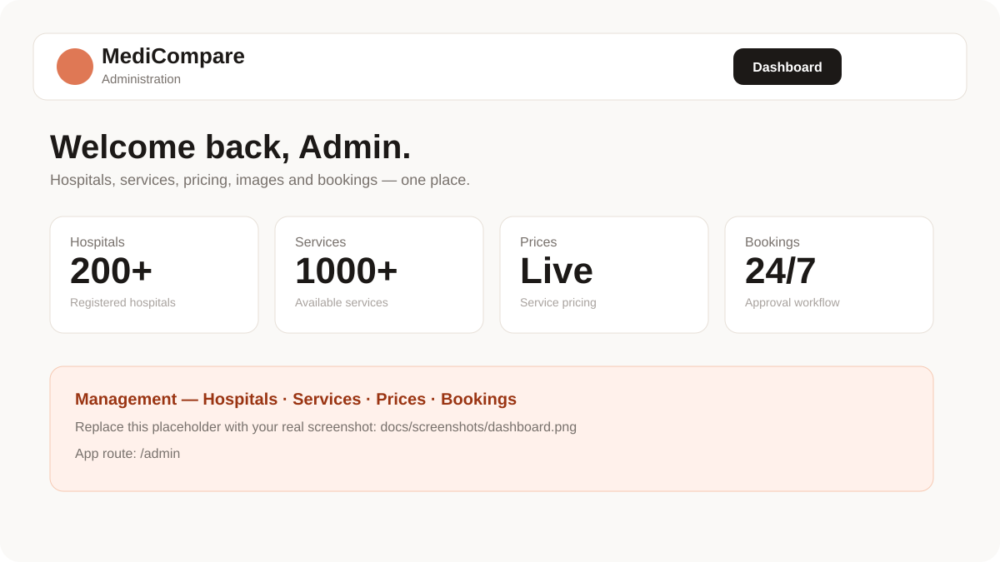
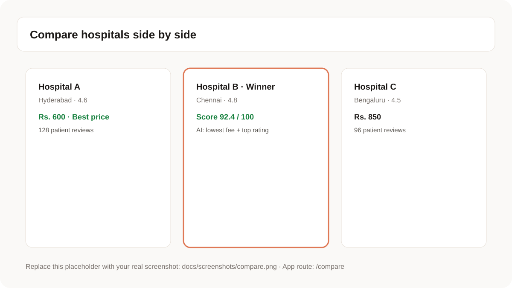
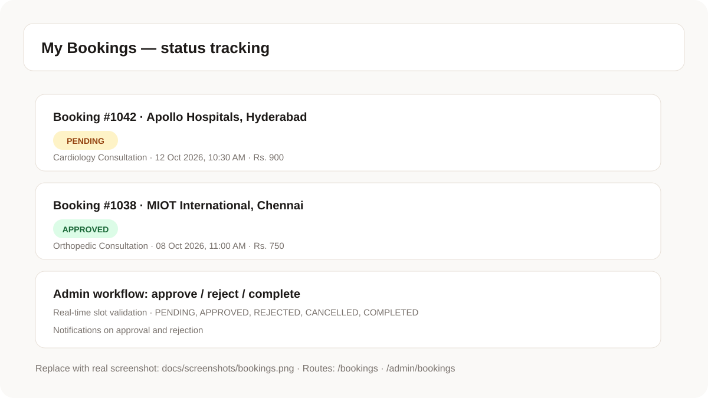

# MediCompare — Compare Hospitals, Prices & Patient Reviews

MediCompare is a full-stack healthcare comparison platform that helps patients choose the right hospital with confidence: transparent service pricing, verified patient reviews, AI-assisted comparison, and end-to-end appointment booking with admin approval.


**Live demo**

- Frontend (Vercel): <https://client-iota-one-53.vercel.app>
- Backend API (Render): <https://medicompare-ai.onrender.com>
- API docs (when backend is running): `https://medicompare-ai.onrender.com/swagger-ui.html`

---

## Table of contents

- [The real-world problem](#the-real-world-problem)
- [The solution](#the-solution)
- [Main features](#main-features)
- [Screenshots](#screenshots)
- [Tech stack](#tech-stack)
- [Architecture](#architecture)
- [Getting started](#getting-started)
- [Environment variables](#environment-variables)
- [Demo accounts](#demo-accounts)
- [Project structure](#project-structure)
- [API overview](#api-overview)
- [Deployment](#deployment)
- [Roadmap](#roadmap)
- [License](#license)

---

## The real-world problem

Choosing a hospital in India today means juggling disconnected sources: one site for addresses, phone calls for prices, word-of-mouth for quality, and no reliable way to compare options side by side. Consequences for patients:

- **Hidden pricing** — consultation and procedure costs vary widely and are rarely published.
- **Unverified quality signals** — ratings exist, but genuine patient reviews are scattered or missing.
- **No structured comparison** — patients cannot weigh price, rating, reviews, services, and distance together.
- **Booking friction** — appointment requests, slot conflicts, approvals, and status tracking happen over phone calls.

Hospitals and administrators face the mirror problem: no simple dashboard to publish services and prices, manage images, or approve bookings.

## The solution

MediCompare centralizes the full journey in one product:

1. **Discover** — search 200+ seeded hospitals across Andhra Pradesh, Telangana, Tamil Nadu, and Karnataka by name, city, state, type, and rating, with nearby sorting and an interactive map.
2. **Compare with evidence** — select 2–4 hospitals and get a deterministic 0–100 score (price, quality, breadth, review evidence) plus an AI verdict that names the winner and explains why, grounded only in real data.
3. **Book reliably** — real-time slot availability, conflict protection, approval workflow (pending, approved, rejected, cancelled, completed), and notifications on decision.
4. **Trust through reviews** — every hospital carries patient ratings and written reviews that also feed the AI comparison score.
5. **Operate** — a dedicated admin panel manages hospitals, services and prices, images, and bookings.

---

## Main features

### Admin dashboard

Central control for the whole marketplace: hospital, service, price, image, and booking totals, plus one-click navigation to each management area. Secured by JWT with `ADMIN` role.

### AI hospital comparison

Side-by-side table for 2–4 hospitals (rating, consultation fee, services, prices, availability), deterministic scoring, winner badge, factual reasons (lowest fee, highest rating, most reviews, widest coverage), and a grounded LLM explanation with fallback when AI is unavailable.

### Bookings

Patients request slots from real availability, track live status, and cancel within rules. Admins approve, reject, or complete requests. Slot conflicts are rejected server-side, and users are notified on approval and rejection.

Supporting capabilities: JWT auth (user + admin), favourites, history, profile, password reset over email, hospital image uploads with primary-image handling, review summaries with 1–5 star distribution, recommendations engine, AI chat assistant, and cold-start-resilient frontend networking (retry with backoff plus keep-alive).

---

## Screenshots

Main workflows only. Placeholder graphics render until replaced with real captures — save real screenshots as `docs/screenshots/dashboard.png`, `compare.png`, and `bookings.png`, then update the paths below.

| Admin dashboard (`/admin`) | Hospital comparison (`/compare`) | Bookings (`/bookings`, `/admin/bookings`) |
| --- | --- | --- |
|  |  |  |
| Totals, management cards, and quick actions. | Winner, 0–100 scores, reasons, and AI explanation. | Status tracking and admin approval workflow. |

To use real screenshots:

```text
docs/screenshots/dashboard.png   # /admin
docs/screenshots/compare.png     # /compare with AI verdict visible
docs/screenshots/bookings.png    # /bookings or /admin/bookings
```

---

## Tech stack

| Layer | Technologies |
| --- | --- |
| Backend | Java 21, Spring Boot 4.1, Spring Web, Spring Data JPA, Hibernate, Spring Security, JWT (jjwt), Spring Validation, Spring AI (OpenAI-compatible via OpenRouter) |
| Frontend | React 18, Vite, React Router, Axios, Leaflet + OpenStreetMap, Tailwind CSS |
| Database | PostgreSQL 18 |
| Infra | Docker, Docker Compose, Render (backend), Vercel (frontend) |
| Docs | springdoc-openapi (Swagger UI) |

---

## Architecture

```text
React (Vite)  --REST/JSON-->  Spring Boot API  -->  PostgreSQL
                                     |
                                     +--> Spring AI + OpenRouter (chat, verdict, recommendations)
                                     +--> SMTP (password reset)
                                     +--> Local file storage (hospital images)
```

Backend layers: controllers (public, admin, auth, reviews, bookings, compare, AI), services (booking slots, reviews, comparison verdict, recommendations, notifications, JWT), repositories (JPA), security filter chain (stateless JWT), global exception handler, and idempotent data seeders.

---

## Getting started

Prerequisites: Java 21+, Node.js 20+, PostgreSQL 14+, Maven wrapper included (`mvnw`).

### 1. Database

```bash
docker compose up postgres -d
# or run your local PostgreSQL and create database: medicompare
```

### 2. Backend

```bash
cd server
cp .env.example .env 2>/dev/null || true
# Fill DB_PASSWORD and OPENROUTER_API_KEY (see below)
./mvnw spring-boot:run
```

API runs at `http://localhost:8080`. Swagger UI at `http://localhost:8080/swagger-ui.html`. Health check at `http://localhost:8080/api/hello`.

### 3. Frontend

```bash
cd client
cp .env.example .env
# Set VITE_API_URL=http://localhost:8080 for local development
npm install
npm run dev
```

App runs at `http://localhost:5173`.

### 4. Full stack with Docker

```bash
docker-compose up --build
```

Services: PostgreSQL `:5432`, API `:8080`, client `:3000`. Set `DB_PASSWORD` and `OPENROUTER_API_KEY` in the root `.env` first.

---

## Environment variables

Backend (`server/.env`):

```env
DB_PASSWORD=your_postgres_password
SPRING_DATASOURCE_URL=jdbc:postgresql://localhost:5432/medicompare
SPRING_DATASOURCE_USERNAME=postgres
SPRING_DATASOURCE_PASSWORD=${DB_PASSWORD}
OPENROUTER_API_KEY=your_openrouter_key
JWT_SECRET=long_random_secret_at_least_32_chars
ADMIN_DEFAULT_EMAIL=admin@medicompare.com
ADMIN_DEFAULT_PASSWORD=admin123
MAIL_USERNAME=your_gmail_address
MAIL_APP_PASSWORD=your_gmail_app_password
FRONTEND_URL=http://localhost:5173
```

Frontend (`client/.env`):

```env
VITE_API_URL=http://localhost:8080
```

Production: set `VITE_API_URL=https://medicompare-ai.onrender.com` in Vercel, and the backend keys in Render environment settings. Never commit real secrets.

---

## Demo accounts

Seeded automatically on first backend start (`AdminDataInitializer`):

```text
Admin — email: admin@medicompare.com / password: admin123
```

Patients self-register at `/register`. Reviews require a signed-in user account (one review per user per hospital).

---

## Project structure

```text
medicompare/
  client/                  # React + Vite frontend
    src/
      api/                 # axios instance with retry
      components/          # Navbar, Sidebar, AdminLayout
      pages/               # Home, Hospitals, Compare, Map, Booking(s),
                           # Login, Register, Admin*, AiChat, Recommendations
      utils/               # fetchWithRetry, keepAlive, hospitalFilters, hospitalImage
  server/                  # Spring Boot backend
    src/main/java/com/medicompare/
      admin/               # controllers, JwtService, AdminService
      auth/                # UnifiedLoginService
      booking/             # controller, service, entity, repository, DTOs
      compare/             # comparison + AI verdict service, DTOs
      config/              # Security, JWT filter, data seeders
      controller/          # hospitals, services, images, hello
      entity/              # Hospital
      image/               # HospitalImage, repository, responses
      notification/        # approval/rejection notifications
      recommendation/      # recommendation engine
      review/              # reviews controller, service, DTOs
      serviceentity/       # HospitalService, repository, responses
      user/                # auth, profile, favourites, history
      exception/           # GlobalExceptionHandler
  docs/screenshots/        # README visuals (main features only)
  docker-compose.yml
  render.yaml
```

---

## API overview

- Auth: `POST /api/auth/login`, `POST /api/user/auth/register`, forgot/reset password
- Hospitals: `GET /api/hospitals`, `GET /api/hospitals/{id}`, `GET /api/hospitals/{id}/services`, nearby and meta endpoints
- Reviews: `GET /api/reviews/hospital/{id}`, `GET /api/reviews/hospital/{id}/summary`, `POST /api/reviews/hospital/{id}`
- Compare: `GET /api/compare/hospitals?hospitalIds=1&hospitalIds=2`, `POST /api/compare/ai-verdict`
- Bookings: `POST /api/bookings`, `GET /api/bookings`, `GET /api/bookings/available-slots`, cancel
- Admin: `GET /api/admin/dashboard/stats`, hospitals/services/images CRUD, `GET/PATCH /api/admin/bookings`
- AI: `POST /api/ai/chat`, `POST /api/recommendations/ai`

Full interactive reference via Swagger UI.

---

## Deployment

- Backend Docker image builds with Maven (`server/Dockerfile`) and runs `java -jar app.jar` on Render (`render.yaml`, health check `/api/hello`).
- Frontend is a static Vite build deployed to Vercel (`client/vercel.json` SPA rewrites). Set `VITE_API_URL` in the Vercel dashboard.
- Free-tier note: Render sleeps after inactivity. The frontend warms the API on load, retries with backoff, and pings every 14 minutes to reduce cold starts.

---

## Roadmap

- Real screenshot capture for docs (dashboard, compare, bookings)
- Larger hospital dataset import and photo coverage
- Slot reminders over email and SMS
- Insurance and payment integration
- Analytics for admins (demand, conversion, ratings)

---

## License

MIT. See `LICENSE` if present; otherwise free for personal and educational use with attribution.
